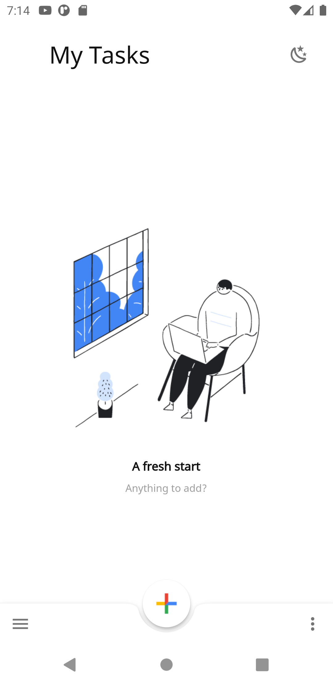
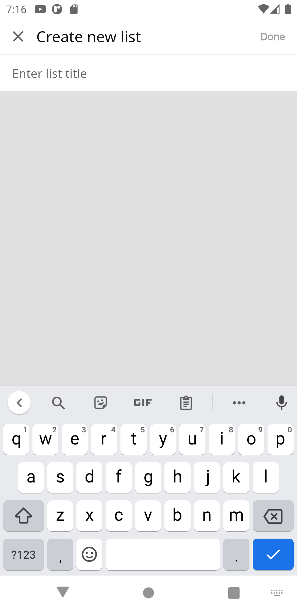
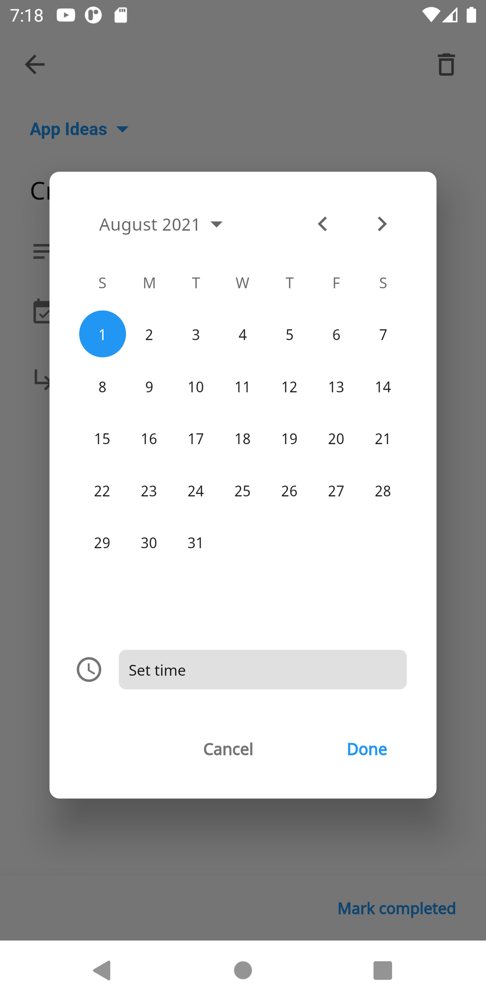
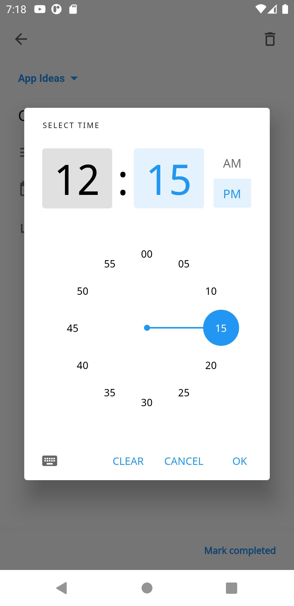
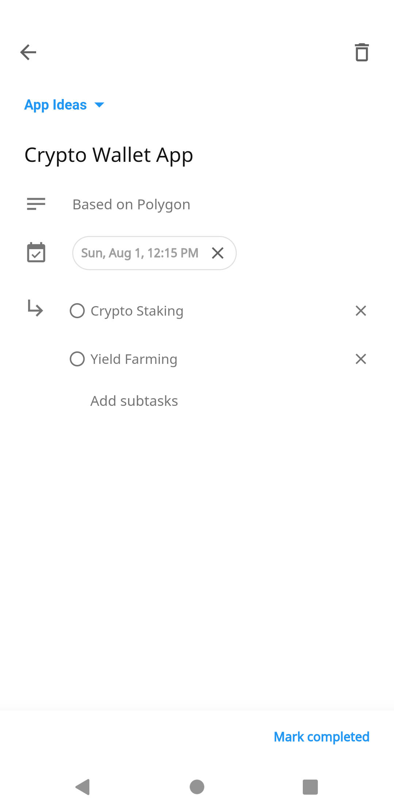
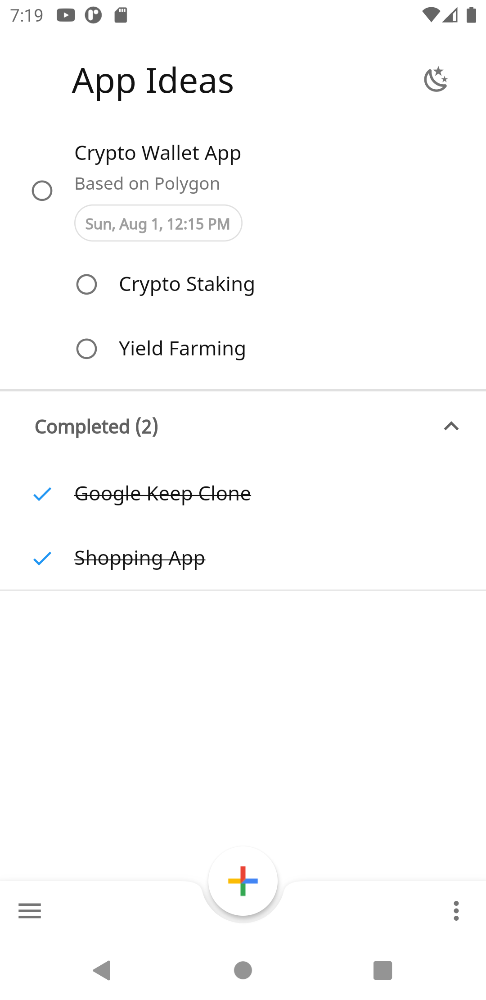
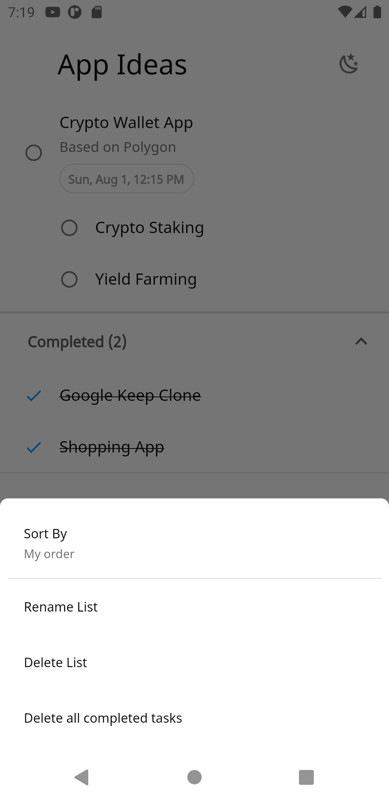
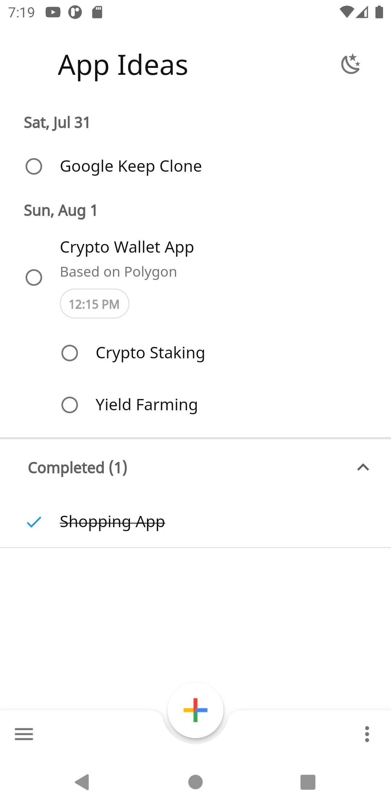
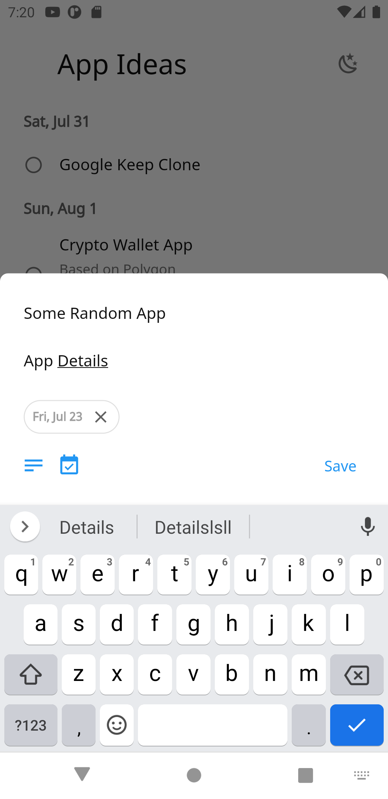
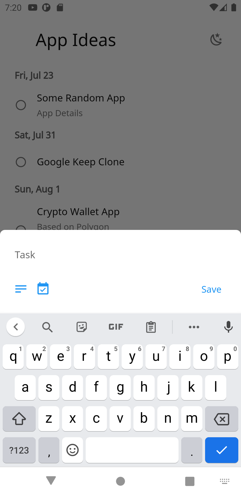

# Tasks

A clone of Google Tasks made in ❤️ with Flutter.

## Screenshots

<kbd></kbd>
<kbd></kbd>
<kbd></kbd>
<kbd></kbd>
<kbd></kbd>
<kbd></kbd>
<kbd></kbd>
<kbd></kbd>
<kbd></kbd>
<kbd></kbd>
<kbd></kbd>
<kbd></kbd>
<kbd></kbd>

## Differences from Google Tasks

- Doesn't use Google Tasks API
- Completed subtasks not separated from parent task when marked complete.
- A parent task having subtasks is considered to be complete when all subtasks are marked complete.

## Upcoming Features

- [ ] User Authentication
- [ ] Import data from Google Tasks API
- [ ] Backup and Sync data with Google Drive

## Development

To run this Project first you need to [Setup Flutter](https://flutter.dev/docs/get-started/install)

1. Install packages<br/>

```sh
flutter pub get
```

2. Run the Project<br/>

```sh
flutter run
```

## Libraries Used

- [Hive](https://pub.dev/packages/hive)
- [Flutter Bloc](https://pub.dev/packages/flutter_bloc)
- [Freezed](https://pub.dev/packages/freezed)
- [Flutter Local Notifications](https://pub.dev/packages/flutter_local_notifications)
